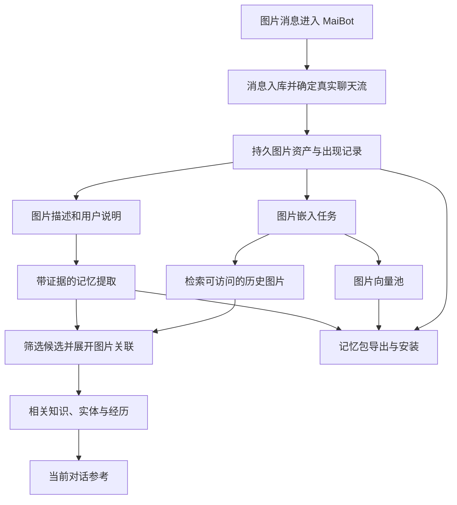

# A_Memorix 图片记忆、相似召回与记忆包扩展方案

文档日期：2026-09-06

状态：2026-09-12已实现本轮指定的五项扩展，并推进真实模型、浏览器、完整CLI聊天和工程验证；结果及边界见第19节

适用范围：当前 MaiBot 工作区中的 A_Memorix 集成版本

交付约定于2026-09-07更新：本次完成本文已确认范围内的全部任务，统一交付，不按 P0—P6 分批发布。P0—P6 只表示内部工作包和依赖顺序。模型效果通过真实评测、问题归因和有依据的优化说明，不设置未经验证的固定分数作为完成门槛。

本文前17节记录需求、初始代码观察与实施裁定，第18节记录2026-09-07完成的实现、测试证据和环境边界。前文第2节描述的是改造前基线，不能再用于判断当前代码能力。

## 1. 已确认的需求与能力边界

### 1.1 图片认知的含义

这里的图片认知是指把图片本身编码成向量，保存其视觉特征，通过新图片与历史图片的相似匹配，调出已有认知。VLM 生成的文字描述可以参与解释，但不能代替图片嵌入。

系统需要同时支持两个目标：

1. 借助历史图片及其关联信息，辅助理解新图片。例如用户曾介绍照片中的猫叫团团，后续图片可以召回这份认知。
2. 即使不能认定为同一图片或同一对象，也能找到相似的历史图片，并拉起当时的讨论、相关事实、知识和经历。例如新的报错截图可以召回相似截图对应的排查过程。

相似匹配本身就是有效结果，不必先完成对象身份确认。系统必须保留候选图片、相似度和信息来源，让当前模型判断历史内容是否适用于新图片。

### 1.2 记忆包的目标

图片记忆应能够随 `.amembundle` 导出和安装。接收实例完成安装及必要的嵌入构建后，应当能够：

- 展示包内图片和认知内容。
- 用新图片检索包内的相似图片。
- 从命中图片取回关联的知识、实体和经历。
- 在模型兼容时复用图片向量，在模型不兼容时根据图片文件重新嵌入。
- 正确处理重复安装、作用域映射、共享资源和卸载。

### 1.3 不同识别目标需要分别验证

| 目标 | 含义 | 首期处理原则 |
| --- | --- | --- |
| 精确同图 | 图片字节完全一致 | 使用内容哈希确认 |
| 变体相似 | 压缩、缩放、裁剪、轻度编辑后的图片 | 使用视觉向量检索，以样本验证效果 |
| 内容相似 | 场景、构图、物体类别或界面相近 | 返回候选图片及其相关内容 |
| 同一具体对象 | 不同照片中的同一只猫、同一件物品等 | 不凭向量分数直接确认，需要额外证据 |

本次完整交付覆盖静态图片的持久保存、图片嵌入、以图搜图、关联记忆召回、记忆包迁移，以及第12节列出的对话、WebUI、历史回填、维护和验证任务。动图多帧、视频、局部区域索引、跨照片对象身份识别和文字搜图仍属于原先明确排除的后续扩展；一次性交付不改变这些既定边界。表情包是否纳入自动入库范围需要独立配置，避免混淆现有表情发送与管理逻辑。

## 2. 当前实现与缺口

### 2.1 现状依据

| 模块 | 已有行为 | 与图片记忆的差距 |
| --- | --- | --- |
| `src/chat/image_system/image_manager.py` | 保存图片，按 SHA-256 查缓存，通过 VLM 生成描述 | 没有图片向量生成和相似检索 |
| `src/common/database/database_model.py` 中的 `Images` | 保存图片哈希、描述、文件位置和识别状态 | 没有图片向量、按消息出现的认知和记忆关联 |
| `src/services/embedding_service.py` | 提供文本嵌入服务 | 缺少有明确输入类型的图片嵌入接口 |
| `src/llm_models/model_client/base_client.py` 中的 `EmbeddingRequest` | `embedding_input` 为字符串 | 尚未表达图片字节、格式和预处理契约 |
| `src/A_memorix/core/embedding/api_adapter.py` | 对文本和文本列表生成嵌入 | 没有图片编码调用链 |
| `src/A_memorix/core/storage/vector_store.py` | 提供 FAISS 向量存储与检索 | 可复用基础实现，但尚无图片专用池及生命周期 |
| `src/A_memorix/core/retrieval/dual_path.py` | 编码文字查询，检索文本相关向量和关系 | 没有以图片发起查询和展开图片关联的入口 |
| `src/A_memorix/core/utils/summary_importer.py` | 从历史消息文本生成摘要、实体和关系 | 图片来源引用及其与具体记忆的关联未贯通 |
| `src/A_memorix/core/runtime/services/bundle_admin_service.py` | 导出、安装、卸载文本记忆及可选向量 | 没有图片资产、图片向量和关联记录的迁移 |

现有向量库可以保存数值向量，不代表业务层已经支持图片。当前已检查的写入入口编码的是段落正文、实体名称和关系文本，查询入口编码的是文字问题。

### 2.2 后台图片描述与记忆输入的断点

普通入站消息使用 `enable_heavy_media_analysis=False`。未命中描述缓存时，图片组件本次返回空文本并启动后台识图，消息随后入库。

后台识图完成后会更新图片表；`src/maisaka/visual/chat_history_refresher.py` 刷新内存中的图片组件和对话文本。但已检查的刷新路径没有将新文本更新回消息表，`src/common/utils/utils_message.py` 的消息存储方法也明确没有 update 机制。

自动摘要重新查询消息数据库，并通过 `src/services/message_service.py` 读取 `processed_plain_text`。因此当前对话看到图片描述，并不保证摘要输入也包含该描述。

图片记忆实施时应通过带图片引用的结构化记忆输入解决这个问题，不能继续依赖入站瞬间的文本快照。该判断针对当前检查到的调用链，不代表已经量化了运行环境中的实际遗漏比例。

### 2.3 记忆包的现有限制

当前格式版本为 v1，成员包括 `manifest.json`、`knowledge.json`、可选 `state.json`、可选段落和图关系向量，以及 `checksums.json`。

导出以段落为起点收集关联资源。当前代码中成员数上限为32，解压后总大小上限为1 GiB，加载时把成员内容读入内存。加入大量图片后，不能只增加几个 ZIP 文件名，还需要调整选择器、容量限制、流式处理、资源归属和恢复机制。

## 3. 总体架构与代码归属

### 3.1 完整业务链



图中的关联查询节点读取已经保存的关联。当前消息的认知和长期事实可以在后续处理完成后补充，不要求与即时相似检索同步完成。

### 3.2 MaiBot 负责接入，A_Memorix 负责记忆业务

| 归属 | 工作内容 |
| --- | --- |
| MaiBot | 图片消息接收、真实聊天流解析、图片数据提供、嵌入 Provider 调用、对话上下文接入、WebUI 和配置展示 |
| A_Memorix | 持久资产、图片元数据、嵌入任务编排、图片向量池、相似检索、认知与记忆关联、资源维护、记忆包迁移 |

模型协议实现留在宿主服务层。A_Memorix 通过注入的图片嵌入接口使用模型，不在图片记忆业务中直接调用某家 Provider 的 SDK。

根据 [A_Memorix 修改规定](../src/A_memorix/MODIFICATION_POLICY.md)，属于 `src/A_memorix/core/` 的数据、业务、检索和包格式改动，应优先在上游 `MaiBot_branch` 实现，再同步回 MaiBot。本方案没有据此发起实现、上游提交或同步操作。

### 3.3 建议的模块组织

下列名称为拟新增模块，实施时可按上游结构调整：

| 拟新增模块 | 职责 |
| --- | --- |
| `image_asset_service.py` | 图片持久保存、哈希校验、读取和引用释放 |
| `image_memory_service.py` | 图片注册、认知维护、关联写入和业务门面 |
| `image_search_service.py` | 相似图片检索、候选组织和关联记忆展开 |
| `image_embedding_adapter.py` | 适配宿主图片嵌入接口，暴露实际模型指纹 |
| `metadata_image.py` | 图片相关表的读写和事务操作 |
| 图片嵌入后台任务服务 | 持久任务领取、失败记录、恢复和索引发布 |

通过 `SDKMemoryKernel` 和 host service 暴露稳定接口。业务调用方不直接打开 A_Memorix 的 SQLite 或实例化内部向量库。

## 4. 数据模型设计

### 4.1 资产与出现记录分离

图片资产描述字节内容，图片出现记录描述使用场景。相同图片可以对应多次聊天出现和多个知识包安装，不能把一条全局图片记录同时当作用户认知和作用域依据。

建议的逻辑表如下：

| 表 | 主要字段 | 约束与说明 |
| --- | --- | --- |
| `image_assets` | `asset_id`、`content_hash`、`storage_key`、`mime_type`、宽高、字节数、创建时间、资产状态 | 内容哈希唯一；存储相对资产键，不存来源机器的绝对路径 |
| `image_occurrences` | `occurrence_id`、`asset_id`、来源类型、来源引用、消息 ID、组件位置、作用域、真实 `chat_id`、时间 | 一张消息中的图片按组件位置区分；外部引用用于幂等 |
| `image_observations` | `observation_id`、出现记录、内容、来源类型、证据、确认状态、版本 | 用户说明与模型描述分开保存；纠正保留来源 |
| `image_memory_links` | `link_id`、出现记录、目标类型、目标 ID、关联类型、证据、状态 | 关联段落、实体、关系或 Episode；失效目标不能继续召回 |
| `image_embeddings` | `asset_id`、指纹、向量 ID、索引世代、构建状态、更新时间 | 资产与指纹组成唯一键；不同模型不共享同一记录 |
| `image_embedding_jobs` | 任务 ID、资产、目标指纹、状态、租约、尝试次数、错误、目标版本 | 支持进程中断恢复和并发去重 |

表结构通过 A_Memorix 正常 schema 迁移增加，不改动固定的 `legacy_migration`。现有 `Images` 表仍作为 MaiBot 图片缓存与描述系统使用，避免把 A_Memorix 的作用域和安装语义塞入缓存表。

### 4.2 标识与幂等

- 资产哈希基于持久保存的原始入库字节。若入站已压缩，只能把压缩后字节视为本次可用资产，不能声称保存了适配器原图。
- 嵌入预处理可以缩放、裁剪或转换色彩，但不能改变资产身份。预处理规则进入模型指纹。
- 聊天出现记录使用平台、真实聊天流、消息 ID 和组件位置构造幂等外部引用；不自行计算聊天流 fallback hash。
- 知识包安装中的出现记录使用安装 ID 与包内记录 ID 建立映射。同一包安装到不同范围，保留不同的作用域记录。
- 图片向量可以按资产复用，用户说明、来源对话和记忆关联不能因资产相同而合并作用域。

### 4.3 认知与证据

至少区分 `model_description`、`user_statement`、`user_confirmed` 和 `imported_knowledge` 四种来源。导入的知识应保留原有来源类型和确认状态，安装本身不等于用户确认。

例如模型认为画面中是一只橘猫，用户说这是团团，应保存两条不同来源的观察。后续用户纠正照片中的猫不是团团，修正的是名称或对象关联，不需要改变图片向量。

所有认知最终都通过出现记录和作用域访问。全局资产去重只减少存储与计算，不能扩大信息的可见范围。

## 5. 图片嵌入与向量池

### 5.1 宿主接口

建议在 `EmbeddingServiceClient` 增加独立的 `embed_image()`，输入包括图片字节、MIME 类型、真实会话归属和明确的预处理配置。底层请求类型需要能够表达图片，不能把文件路径或 Base64 当作普通文本传给现有接口。

输出包括：

- 数值向量。
- 实际 Provider、模型标识和版本信息。
- 预处理及归一化标识。
- 实际输出维度。
- 根据真实请求确认的模型指纹。

首次实现应选定一个确实支持图片输入的嵌入后端，完成协议适配和样本验证。本文不预设具体型号、价格、硬件需求或准确率。

### 5.2 指纹与兼容性

图片池与文本池分离。图片指纹至少覆盖模型空间标识、可用的模型版本、预处理版本、输出维度、归一化方式和输入模态契约。指纹不得包含密钥。

向量维度一致不足以证明兼容。缺少可靠指纹时，包内向量不可直接复用。模型版本或预处理变化后，应启动新世代重建，校验完成后切换索引。

如果后续实现文字搜图，应使用与图片编码器对齐的文本编码器，并单独记录查询编码协议。现有文本记忆的 embedding 不默认满足这一条件。

### 5.3 存储与状态

图片池复用现有 `VectorStore` 的持久化和相似检索实现，但使用独立目录、指纹、维度和健康状态。不得把图片池附着在当前文本双池的同一个就绪标记上。

建议区分：

| 状态 | 含义 |
| --- | --- |
| `pending` | 资产已经保存，等待嵌入 |
| `running` | 正在生成嵌入 |
| `ready` | 指纹校验和索引写入完成，可检索 |
| `failed` | 本次构建失败，保留具体原因 |
| `stale` | 当前模型或预处理已变化，需要重建 |
| `unavailable` | 资产缺失或目标实例没有所需能力 |

生成任务使用数据库租约和版本检查。发布结果前重新检查资产是否仍有效、目标世代是否仍相同，防止删除或模型切换后旧任务把资源重新写回。

模型超时等可恢复错误可以有限重试；认证错误、格式不支持、维度和指纹冲突应明确失败。模型不可用不能静默伪装成未找到相似图片。

## 6. 图片进入记忆与对话的流程

### 6.1 入站链路

1. MaiBot 完成图片缓存保存、消息处理和真实聊天流注册。
2. 消息入库后，接入层提交图片引用及来源信息。
3. A_Memorix 在确认持久资产保存成功后提交资产、出现记录和嵌入任务。
4. 后台任务按资产和指纹复用已有向量，或生成新向量。
5. 针对当前图片执行历史匹配，排除当前出现记录。
6. 写入当前索引并发布结果。任务和查询状态可被对话层读取。

精确同图的历史出现记录应保留为有效召回结果。不能简单排除整个资产 ID，否则会丢失之前发过这张图片的记录。

若异步任务只保存源缓存路径，应确保任务完成复制前缓存不会被清理。更稳妥的方案是在提交持久任务前完成受控暂存，再由资产服务发布。不能留下指向可能随时消失的缓存路径的已提交任务。

### 6.2 对话接入

在 Maisaka 构建本轮图片上下文时查询对应的图片记忆结果，或者由规划器显式调用图片记忆工具。两种方式共用同一服务和结果契约。

自动接入限制触发图片数、候选图片数和关联记忆长度。图片检索沿用服务与模型请求超时，不增加独立等待预算；异常应按真实原因报告，不能作为没有匹配处理。

上下文中应明确包含：

- 当前查询图片的引用。
- 历史候选图片的引用及可用缩略图。
- 匹配类型和分数。
- 历史认知、来源与关联记忆。
- 候选是否只是视觉相似，是否存在用户确认。

模型可以参考候选内容，但不能直接把历史图片的名字、人物身份、报错原因或解决结果复制为当前图片事实。

## 7. 相似检索与关联记忆召回

### 7.1 建议接口

以下为逻辑接口，不是已经提供的 API：

| 接口 | 输入重点 | 输出重点 |
| --- | --- | --- |
| `ingest_image_memory` | 图片资产输入、来源、作用域、幂等引用 | 资产 ID、出现记录 ID、任务状态 |
| `search_image_memory` | 当前图片引用、作用域、候选限制、可选时间范围 | 图片命中和关联记忆 |
| `link_image_memory` | 图片出现记录、目标资源、证据 | 关联记录与验证结果 |
| `update_image_observation` | 认知记录、修正内容、来源 | 新版本及被取代关系 |
| `get_image_memory` | 图片或出现记录 ID、访问上下文 | 可见图片、认知和关联 |
| `image_memory_admin` | 删除、重建、状态查询等管理操作 | 明确的操作和能力状态 |

对外图片查询使用已登记的图片引用或受控上传输入，不让业务调用方随意读取目标机器上的任意文件路径。进程内宿主适配器可以提供受信任的字节流。

### 7.2 返回结构示例

```json
{
  "status": "ready",
  "query_asset_id": "asset_query",
  "hits": [
    {
      "asset_id": "asset_history",
      "match_kind": "visual_similar",
      "similarity": 0.87,
      "occurrence_ids": ["occurrence_history"],
      "observations": [
        {
          "text": "这张截图来自之前的一次连接失败讨论",
          "source_kind": "user_statement"
        }
      ],
      "memory_refs": [
        {
          "target_type": "paragraph",
          "target_id": "paragraph_history",
          "link_id": "link_history"
        }
      ]
    }
  ]
}
```

示例分数只用于说明格式，不是建议阈值，也不是身份确认概率。完整实现还应提供来源、可访问图片句柄和资源状态。

### 7.3 检索步骤

1. 解析当前真实聊天流及已有共享记忆规则，取得可访问的图片出现记录。
2. 转换为允许检索的资产集合，在该集合内执行精确哈希命中和向量检索。
3. 排除当前出现记录，合并相同资产的重复候选，保留可见历史出现记录。
4. 根据已校准的图片阈值筛选候选，保留前若干张。
5. 从候选的可见出现记录查询直接记忆关联。
6. 再次验证目标记忆的作用域、删除状态、修正状态和生命周期状态。
7. 合并重复记忆，记录每条记忆由哪些图片和关联召回。
8. 按图片相关性、关联证据和当前查询需要组织输出，控制总长度。

优先利用现有 `allowed_ids` 能力进行范围内检索。仅在全库 Top-K 后过滤会造成范围内召回不足，不能作为唯一实现。

### 7.4 关联扩展

首期只返回直接关联的段落、实体、关系和 Episode。文本记忆的 BM25、图谱和其他检索能力可以作为后续融合通道，但视觉分数与文本、图谱分数不能未经校准直接相加。

若加入图谱扩展，应限制跳数、节点数量和证据来源。每条扩展结果要能追溯到候选图片及中间关联，避免相似图片把整个图谱的弱相关内容带入上下文。

## 8. 图片认知与关联的生成和修正

### 8.1 结构化记忆输入

为记忆提取增加带来源的消息表示，保留消息 ID、发言者、文本、图片引用、已完成描述及描述来源。记忆提取时按引用查询描述，不依赖旧的 `processed_plain_text` 已被回填。

图片描述后续完成时，应标记相关提取窗口需要补充处理，通过输入版本和幂等标识保证不重复生成相同事实。不要因为描述完成就无条件重建全部历史摘要。

### 8.2 逐条关联事实

提取结果应能表达每条事实使用了哪些消息、图片和用户说明。不能只有窗口级图片列表，再把所有图片关联到摘要中的所有事实。

服务端至少校验：

- 返回的图片与消息引用确实属于本次可见输入。
- 引用作用域符合当前记忆写入范围。
- 关联目标已经保存且类型正确。
- 用户确认来源不是由模型自行生成。
- 事实与图片之间具有明确说明、回复关系或其他可解释证据。

一句话同时谈论多张图片时，允许暂不建立确定关联；不能用最近图片作为无条件兜底。

### 8.3 修正与生命周期

图片相似召回本身不会自动产生确定认知。用户纠正、明确确认或管理员维护可以更新认知与关联状态。

段落被改写、合并或删除时，图片关联必须同步更新、重映射或失效。失效记忆不得通过图片路径再次出现。实体重命名尽量保留稳定资源身份；若现有操作会改变 ID，需要把图片关联纳入已有映射流程。

### 8.4 历史图片回填

新增功能后，旧图片不能仅靠新消息逐渐覆盖。应提供显式的历史回填任务：从消息中的图片引用找到仍存在的缓存资产，恢复出现记录并生成嵌入。

没有可解析真实聊天流、没有来源消息或文件已经缺失的记录，应分类报告。可以保留尚有价值的描述，但不能从描述伪造原图向量，也不能计算 fallback 聊天流 ID 写入正式数据。

历史认知关联重建与图片嵌入回填分开运行。没有足够证据时，只恢复图片和出现记录，不推测其对应人物或事实。

## 9. 记忆包 v2 设计

### 9.1 内容结构

```text
manifest.json
knowledge.json
state.json                     # full 包
images.json                    # 图片记录、认知与关联
assets/images/<hash>.<ext>      # 持久图片文件
vectors/paragraphs.npz          # 可选，现有内容
vectors/graph.npz               # 可选，现有内容
vectors/images.npz              # 可选，新增内容
checksums.json
```

图片原始资产及认知、关联是可迁移内容；向量是可以重新生成的派生索引。正式的含图片记忆包应包含对应图片文件。只有图片描述而没有文件的内容，应明确作为文本知识导出，不能宣称可恢复完整图片记忆。

清单增加图片能力版本、资产和关联数量、图片文件总大小、是否包含图片向量、图片嵌入指纹及必要能力声明。文本指纹与图片指纹分开存放。

新导入端支持旧 v1 包；旧导入端遇到 v2 按版本不支持明确拒绝，不能静默丢弃图片。

### 9.2 内容级别

| 内容 | knowledge | full |
| --- | --- | --- |
| 所选范围的知识及图片文件 | 包含 | 包含 |
| 图片与所选知识的关联 | 包含 | 包含 |
| 可分享的描述、标签和认知来源 | 包含 | 包含 |
| 原聊天出现记录、用户身份和状态 | 不默认携带，使用包内知识来源表示 | 按范围和迁移规则保留 |
| Episode、画像等完整状态 | 沿用现有规则 | 在闭合范围内恢复 |
| 图片向量 | 可选 | 可选 |
| 后台租约和运行任务 | 不导出 | 不导出 |

`knowledge` 包需要生成能够承载图片关联的包内来源记录，但不应为此复制原群聊所有消息。`full` 包同样不等于聊天数据库备份：没有随包恢复的消息只能保留为外部来源标识，不能变成目标实例中的有效本地消息外键。

### 9.3 选择范围与导出闭包

原有全部、来源、聊天流、任务和已安装包选择器继续适用。除按段落关联收集图片外，需要增加按图片或图片集合导出，允许没有文本段落的纯图片记忆包。

导出闭包遵循有限扩展：

1. 根据选择器确定明确选中的记忆与图片出现记录。
2. 收集选中记录所需的图片资产。
3. 仅保留目标也在允许导出范围内的关联。
4. 如需额外带入关联知识，应作为明确的导出选项，并在预览中展示新增范围。
5. 同一资产只写入一次，重复出现记录保留各自的可迁移语义。

不能从图片扩到段落、再从段落扩到其他图片，不设边界地递归收集整个库。缺失文件、被删除目标和悬空关联应在导出预览中报告；要求完整图片导出时不得静默生成残缺包。

### 9.4 图片向量复用

导出图片向量时使用可迁移资产 ID，并保存向量与资产的对应关系。接收端验证实际观测指纹、维度、有限数值、ID 唯一性及资产存在性。

- 指纹完全兼容：直接导入向量，完成索引校验后标记可检索。
- 指纹不同或未包含向量：读取包内图片，通过目标模型重新嵌入。
- 目标没有图片嵌入能力：图片和知识可以完成安装，但图片检索能力明确为未就绪。
- 图片向量文件损坏：校验失败，按安装策略明确拒绝或要求用户重新发起不复用向量的安装，不能忽略损坏并报告完整成功。

安装过程不重新调用 LLM 抽取已打包的知识和认知。必要的图片 embedding 重建属于索引构建，不改变包内事实。

### 9.5 流式安装和中断恢复

将当前整包成员读入内存的加载方式改为按成员流式校验。仍然校验必要成员、成员数量、单成员和总大小、校验和、重复成员、类型与引用完整性。图片写入由目标实例生成的受控暂存位置，不能直接信任 ZIP 内路径进行通用解压。

推荐安装过程：

1. 读取清单，完成格式、能力和容量预检。
2. 流式校验图片并写入安装专属暂存目录。
3. 校验知识、图片记录和关联闭包，建立目标 ID 映射。
4. 创建安装日志，将资产发布到内容寻址目录。
5. 在 SQLite 事务中提交语义数据、资源归属和安装状态。
6. 恢复或重建图与向量投影。
7. 校验后分别更新内容安装状态和图片检索状态，清理暂存资源。

文件、数据库和 FAISS 无法由一个 SQLite 事务原子提交。安装日志需要记录各阶段，支持恢复发布但未登记的资产、重新执行幂等投影，以及清理失败安装的独占资源。不能在索引尚未发布时报告图片检索已经可用。

### 9.6 去重、作用域映射和卸载

包内稳定记录 ID 与目标 ID 分开维护。聊天流来源映射到目标真实聊天流；全局安装使用明确的全局作用域。名称和消息 ID 的展示不能替代真实资源映射。

图片资产、出现记录、认知、关联和向量都要纳入资源归属登记。卸载时：

- 删除该安装创建的独占关联和出现记录。
- 保留其他包或本地聊天仍引用的资产与向量。
- 当最后一个有效引用释放后，才清理文件和向量。
- 同时检查知识包引用和普通业务引用，不能只查其他安装记录。
- 包卸载造成的任务失效必须阻止旧后台任务重新发布资源。

图片资产删除和普通记忆删除共用引用判定，不能各自维护一套互不知情的清理逻辑。

## 10. 接入位置和改动清单

### 10.1 MaiBot 侧

| 现有位置 | 建议改动 |
| --- | --- |
| `src/chat/heart_flow/heartflow_message_processor.py` | 消息入库后提交带真实来源的图片任务 |
| `src/chat/image_system/image_manager.py` | 向接入层提供已保存图片与描述，不承担记忆作用域判定 |
| `src/services/embedding_service.py` | 新增图片嵌入门面 |
| `src/llm_models/model_client/base_client.py`、调度器及实际 Provider | 新增图片请求类型并完整贯通调用、统计和错误 |
| `src/services/memory_service.py` | 图片写入、查询和管理封装 |
| `src/services/memory_flow_service.py`、消息读取适配 | 结构化图片引用、证据和后续描述补齐 |
| `src/maisaka/reasoning_engine.py` 及上下文构建 | 注入相似图片和关联记忆，控制输出长度，沿用服务与模型超时 |
| `src/webui/routers/memory.py` 与 dashboard 记忆页面 | 图片列表、详情、相似检索、状态、维护和记忆包预览 |

### 10.2 A_Memorix 上游侧

- 扩展 schema，增加图片资产、出现、认知、关联和嵌入任务存储。
- 增加图片资产服务、图片记忆服务和图片搜索服务。
- 注入图片 embedding 适配器，初始化独立向量池和能力状态。
- 将图片引用和逐事实证据接入摘要与记忆写入。
- 扩展删除、修正、合并、重命名和资源维护的图片关联处理。
- 扩展 bundle v2、选择器、流式安装、资源归属和卸载。
- 更新公共接口、格式文档和兼容性说明。

### 10.3 配置、提示词和依赖

建议配置覆盖启用开关、支持的图片类型和大小、嵌入任务、并发限制、候选数量、阈值、关联输出上限、持久资产容量、历史回填和记忆包容量。图片检索沿用服务和模型请求超时，不另设对话等待预算。

阈值在选定模型后通过样本校准，不直接复制文本检索阈值。首期阈值可以按能力分开，例如视觉相似候选阈值与近重复候选阈值，但不能把后者解释为对象身份确认。

实施配置变更时遵循项目规定：修改模板或模板生成定义并新增版本号，不修改实际 `bot_config.toml`、`model_config.toml`，不擅自新增 `ConfigUpgradeHook`，不改 `legacy_migration`。依赖以 `pyproject.toml` 为准，同步 `requirements.txt`，优先使用 uv。

若修改现有 prompt 模板，需要同步中文、英文和日文内容。图片来源和确认状态属于输入数据契约，不能只依赖一段提示词约束。

## 11. WebUI 与运行维护

建议增加图片记忆视图，提供：

- 图片缩略图、描述、来源聊天名称和出现时间。
- 精确重复与视觉相似检索结果。
- 图片关联的知识、实体和经历，以及具体关联证据。
- 认知确认、纠正和删除错误关联。
- 嵌入排队、失败原因、模型指纹和重建进度。
- 历史图片回填预览与结果。
- 记忆包图片数量、文件体积、缺失资源、向量兼容性和安装能力状态。

WebUI 通过受控资源接口读取图片，不能依赖目标机器的绝对路径。缩略图是派生文件，可按需生成，不必作为包内真值保存。来源优先显示实际群名称或私聊名称。

运行统计应记录资产数、出现记录数、就绪向量数、任务失败数、存储体积、各检索阶段耗时和关联召回数量。只完成文件保存但没有向量的图片不能计入可检索图片数。

## 12. 一次完整交付与内部实施顺序

以下编号只用于安排依赖、跟踪任务和组织测试，不是独立发布版本，也不是可以提前结束本次工作的交付切片。所有工作包都属于本次任务，集成验证贯穿实施过程。

| 内部工作包 | 本次必须完成的内容 | 验证重点 |
| --- | --- | --- |
| P0：接口与模型验证 | 图片输入契约、模型指纹方案、代表性样本基线 | 后端实际接受图片，同图和相似图行为可复现 |
| P1：资产与数据 | 持久图片目录、schema、出现记录、任务和幂等 | 去重正确，缓存清理不影响持久资产，重启不丢任务 |
| P2：嵌入与检索 | 独立图片池、范围内检索、结果接口 | 可区分精确同图与相似候选，范围过滤正确 |
| P3：认知与关联 | 结构化输入、逐事实证据、关联召回、修正联动 | 自动摘要链路完整运行，报告关联效果、失败原因和修正行为，不用预设分数代替实现检查 |
| P4：记忆包 v2 | 图片导出、流式安装、向量复用、重建和卸载 | 新实例导入后保留图片、关联和可用检索能力 |
| P5：对话与管理 | 自动召回、工具入口、WebUI、状态和回填 | 对话可实际使用历史图片知识，维护操作可观察 |
| P6：完整性与性能 | 迁移、故障恢复、容量和延迟验证 | 中断不产生悬空资源，性能满足约定预算 |

P0 就需要确定包内稳定 ID、资产归属和向量指纹；不能等到 P4 再补这些基础约束。P2 的接口测试与 P5 的对话测试可以分别执行，但必须在本次共同完成并通过端到端集成验证。不能仅交付以图搜图后，将自动关联、记忆包、对话、WebUI、历史回填或恢复机制顺延到下一次。

数据完整性、作用域隔离、删除不复活和恢复语义从相关实现首次落库时就开始验证。P6 扩大验证覆盖和规模，不是此前可以忽略正确性的理由。开发过程中允许小步提交和内部检查，不因此形成分阶段产品发布。

## 13. 验证计划

### 13.1 检索质量

建立小规模可重复的图片集合，覆盖完全相同、不同压缩率、缩放、裁剪、轻度编辑、同类别不同对象、相似界面不同错误、完全不相关图片。

分别报告：

- 精确同图命中率。
- 相似图片 Recall@K 和 Precision@K。
- 易混淆负样本的错误召回率。
- 关联记忆召回正确率。
- 图片输入到结果的 P50、P95 延迟。

身份确认不作为普通向量检索指标。没有足够样本时，不宣称能够稳定认出不同照片中的同一对象。模型选择、阈值和预算在 P0、P2 的测量结果基础上确定。

评测指标用于描述实际能力、比较合理方案和定位失败原因，不设置未经基线验证的固定正确率、覆盖率或每类样本数作为强制完成条件。样本规模应与覆盖需求、数据可得性和结论可信程度相符，报告样本来源、构成、数量、标注歧义和测量条件。

结果低于预期时，区分实现错误、模型局限、图像质量、上下文缺失、标注争议、数据分布和资源限制。修复属于当前实现的问题，验证有依据的优化；不得删难例、改变指标口径、混入人工关联结果或针对验收样本硬编码来提高分数。也不能仅因未达到预想数值就无限重复调参，或撤掉自动关联功能来宣布完成。

检索候选阈值是需要校准的运行参数，与发布或完成工作的硬性分数门槛不同。修复后仍受模型能力限制的场景，应保留实际结果并说明影响；不能用模型局限解释可复现的作用域泄漏、引用失效、数据丢失或任务恢复错误。

### 13.2 数据、作用域和关联

- 同图多次出现只生成一份兼容嵌入，保留多次来源。
- 同一资产跨聊天流出现时，不泄露其他范围的说明和记忆。
- 当前出现记录被排除，历史同图记录仍可命中。
- 一条记忆被多张图片关联时，输出去重并保留多条召回依据。
- 被删除或纠正的事实不会从图片路径复活。
- 后台描述晚到后，只补充受影响的提取任务，不重复写入事实。
- 模型不可用、资产缺失和无匹配结果具有不同状态。

### 13.3 记忆包

- v1 包继续正常安装，v2 图片包可完成往返导出。
- 纯图片包、混合知识包和 full 包分别覆盖。
- 相同图片跨包复用，卸载一个包不影响其他包及本地聊天引用。
- 同包同范围重复安装幂等，安装到不同范围映射正确。
- 模型指纹兼容时复用向量；不兼容时重新嵌入。
- 接收实例没有图片模型时，内容安装与图片检索状态分别呈现。
- 缺失成员、错误校验和、重复 ID、悬空关联和容量超限明确失败。
- 多于32张图片的包验证新的成员处理与内存占用。
- 在暂存、资产发布、事务提交和向量发布阶段分别中断，验证重试及清理。

### 13.4 生命周期与并发

- 删除图片时存在嵌入任务，旧任务不能重新发布被删除资源。
- 更换模型时旧世代任务不能污染新索引。
- 两条消息并发提交同图，不重复创建资产或冲突写入向量。
- 普通图片缓存清理不删除长期图片资产。
- 最后一个有效引用释放后，文件和向量可被一致地回收。

自动化测试以确定性数据和伪造嵌入验证逻辑，真实模型质量另外评测，不能用向量单元测试代替图片识别效果。真实图片样本和本地实验遵守项目关于共享历史的限制，未经明确要求不提交本地实验目录、模型缓存或私人图片。

## 14. 实施前需要确定的选项

以下问题影响具体实现，应在对应工作包开始前确定。它们不影响先完成 schema、接口和资源边界设计，也不构成把已确认任务移到后续交付的理由。

| 问题 | 建议起点 | 确定工作包 |
| --- | --- | --- |
| 图片 embedding 后端 | 选择一个实际支持图片输入的后端做完整验证 | P0 |
| 自动入库范围 | 先普通静态图片，表情和动图单独控制 | P0—P1 |
| 资产保留策略 | 进入图片记忆的文件持久保存，由记忆引用和显式策略管理 | P1 |
| 候选数量与阈值 | 根据正负样本校准，不沿用文本配置 | P2 |
| 自动建立关联的证据要求 | 用户明确说明、回复关系和经验证的提取引用 | P3 |
| knowledge 包的可分享认知范围 | 保留选中知识所需内容，不默认带原聊天身份 | P4 |
| 自动对话请求超时 | 沿用服务和模型请求机制，不增加独立等待预算 | P5 |
| 历史回填规模 | 先预览可恢复资产与来源，再分批执行 | P5 |

## 15. 完成标准

完成判断分为任务覆盖、工程正确性和模型效果三部分。任务覆盖要求本次所有工作包实际完成；工程正确性要求数据、引用、作用域、幂等和恢复等契约成立；模型效果要求真实测量、错误归因、必要优化和如实说明能力边界，不承诺每次都识别正确或达到预设百分比。

以下场景全部成立，才算图片记忆与记忆包功能形成完整链路：

用户发送图片并提供说明，系统保存图片特征与有来源的认知。之后发送相似图片，系统返回历史候选及其关联知识，并保留相似证据与确定事实之间的区别。将这些记忆导出为包并安装到另一实例后，同样的匹配和知识召回仍然可用；模型变化、资源共享、删除、卸载和重启不会破坏关联或产生错误状态。

上述场景要求链路实现完整并有实际验证证据，不代表要求所有语义样本命中。没有证据或无法确定时允许输出空关联或相似候选，不能编造确定事实。

最终交付同时提供任务完成清单、端到端验证、实际质量与性能结果、已知模型局限及运行说明。尚未实现的消费者、未接通的调用路径、未验证的真实后端或未解决的工程错误必须列为未完成项，不能用数值未达预期或所谓阶段完成替代完整交付。

本次文档交付只保存上述分析和计划，不包含业务代码修改、schema 迁移、实际配置修改或上游提交。

## 16. 本地参考

- [A_Memorix 修改规定](../src/A_memorix/MODIFICATION_POLICY.md)
- [现有记忆包格式](../src/A_memorix/docs/memory_bundle_format.md)
- [图片管理器](../src/chat/image_system/image_manager.py)
- [消息入库接入](../src/chat/heart_flow/heartflow_message_processor.py)
- [图片上下文刷新](../src/maisaka/visual/chat_history_refresher.py)
- [宿主嵌入服务](../src/services/embedding_service.py)
- [A_Memorix 嵌入适配器](../src/A_memorix/core/embedding/api_adapter.py)
- [向量存储](../src/A_memorix/core/storage/vector_store.py)
- [现有检索实现](../src/A_memorix/core/retrieval/dual_path.py)
- [摘要导入](../src/A_memorix/core/utils/summary_importer.py)
- [记忆包管理服务](../src/A_memorix/core/runtime/services/bundle_admin_service.py)
- [记忆包现有测试](../pytests/A_memorix_test/test_memory_bundle_admin.py)

## 17. 计划执行核对项（2026-09-07）

本节是对照现有代码审阅方案后的执行核对清单。根据2026-09-07的用户修正，保留已确认功能范围，撤回固定质量分数门槛和分阶段发布建议；P0—P6 仅作为本次完整交付的内部工作顺序。

核对边界：

- 方案原文已经写明的功能任务和工程正确性约束仍然有效；模型效果按第13.1节和第17.1.2节实证评估。
- 下面只收录「实施前应补进规格或验收」的问题，以及「不要再当作方案缺陷」的过重结论。
- 二次裁定后的总判断：方案没有结构性不相容；上一轮把「当前代码没有这项能力」写成「方案做不成 / 方案没安排」的部分，一律撤回。

### 17.1 仍须补强的执行问题

下列问题不影响先做 schema、接口和资源边界，但在对应工作包实施前应写进任务说明，避免实施者只改入口、漏掉真正的消费者或现有调用链。它们均属于本次需要完成的执行工作。

#### 17.1.1 四条路径必须分开写，摘要改造要串成任务链

出现登记、聊天摘要提取、人物事实提取、对话注入是四条路径，不能用一条笼统的「结构化输入」代替。

第 10.1 节把 `memory_flow_service.py` 和消息读取适配写在一起，容易让实施者只改消息入口或人物事实写回，却漏掉聊天摘要主路径。自动摘要由 `ingest_summary` 进入 `summarize_chat_stream`，再由 `summary_importer.py` 读取历史消息、构建输入、按 `{summary, entities, relations}` 抽取，通常经 `_execute_import` 调用 `ingest_text` 统一落库。P3 要实际完成这条契约改造，不把记忆主路径改成逐条消息入库，也不能只扩展 `ingest_summary` 的参数。

P3 开始前应把摘要改造写成明确任务链：

1. 消息读取适配：保留消息 ID、发言者、文本、图片引用、已完成描述及来源。
2. 可读文本或结构化输入进入摘要提示词。
3. 提示词输出契约增加逐事实来源。当前摘要提示词内嵌于 `SUMMARY_PROMPT_TEMPLATE`，需要迁出并实际接入中文、英文、日文模板，不能只修改未被调用的模板文件。
4. `ingest_summary`、结果解析、`_execute_import` 和公共 `ingest_text` 写入层贯通引用；自动生成和直接提供已有摘要的路径共用验证规则。
5. 引用校验：图片与消息属于本次可见输入、作用域正确、用户确认不是模型自封。
6. 关联落库到出现记录，失效目标不得再召回。

人物事实写回仍可能需要图片证据，但不能替代上述摘要链。Heartflow 只负责入库后提交带真实来源的图片任务；Maisaka 负责对话注入。这两点原文已写对，实施清单不要改职责。

#### 17.1.2 P3 采用真实质量评估，不设置人为达标门槛

撤回此前回答建议的98%关联正确率、90%覆盖率、99%空关联比例、每类至少100例等固定通过线，以及据此决定 P3 是否发布的做法。这些数值缺少具体模型、数据与运行条件的依据，不能直接成为完成工作的契约。

P3 的工作是完成自动摘要证据链、关联写入、召回和修正，并真实分析其效果。验证需要回答：

- 样本是否覆盖用户明确说明、回复关系、经验证引用、一句话多图、无确定关联和已纠正关联。
- 关联正确率、有证据事实的覆盖率、错误关联率和空关联行为分别如何；各类样本和数量需要如实报告。
- 失败源于实现缺陷、输入或证据不足、模型能力、数据分布、标注歧义，还是资源限制；分类依据是什么。
- 哪些修复或优化已有证据支持，修改前后效果如何，仍有哪些无法消除的能力限制。

不得为了让 P3 达标而删难例、改统计口径、对样本硬编码、把人工关联混作自动提取结果，或在缺乏新依据时无限调参。结果不理想本身不证明架构失败，也不意味着可以删除自动摘要路径、改用显式关联后宣布任务完成。

用户说明、确认、显式 `link_image_memory` 和包内认知都要按原需求实现，但与自动摘要分别测量。自动摘要链路可以完整实现，同时存在真实模型局限；这些局限应被记录，不能包装成保证识别正确，也不能被拿来掩盖尚未完成的功能或工程缺陷。

作用域隔离、引用合法性、幂等、删除不复活和持久恢复属于程序正确性，仍需修复发现的问题。模型对内容的误判与程序把不允许的资源返回给调用方是不同问题，不能用同一组质量分数替代检查。

原文禁止窗口内所有图片无差别挂到所有事实和最近图片无条件兜底。不禁止明确标为非事实性上下文的共现候选；如增加 `window_cooccurrence`，应单独定义并评估，不能用它充当已确认事实或提高自动关联的表面覆盖率。

#### 17.1.3 `content_digest` 必须承诺图片真值

第 9 章没有定义图片加入后 `content_digest` 如何构造。现有 v1 摘要只覆盖 `knowledge.json` 与可选 `state.json`，不含向量。

`checksums.json` 负责成员完整性，不能自动回答「什么变化应被视为不同内容的包」。若摘要参与安装幂等，则至少应保证：

- 图片认知、图片关联或实际图片内容发生变化，即使段落不变，也必须影响包的内容身份。
- 不一定把图片字节再次直接拼入摘要。可以纳入已经过实际字节校验的资产哈希清单，以及规范化后的图片语义记录。
- 向量仍是可重建的派生索引，可用独立指纹和校验，不必然进入 `content_digest`。

P4 开始前应写清：摘要覆盖范围、规范化规则、成员字节校验与内容摘要的分工。

#### 17.1.4 范围内检索要有算法与性能契约

第 7.3 节要求在允许资产集合内检索，并优先利用现有 `allowed_ids`。现有 `VectorStore.search(allowed_ids=)` 是自适应超取后过滤：先从索引取候选，再按允许集合过滤，不足时扩大 `search_k`，直到结果足够或搜到索引总量。它不是索引内部预过滤，也不是固定全库 Top-K 后截断。

因此：

- 不能把 `allowed_ids=` 直接写成「只在可见向量子集中执行搜索」。
- 也不能仅凭这段循环断定范围内召回必然不足。稀疏范围在精确排序前缀假设下仍可能被找到，代价是多次越来越大的搜索。
- 若底层是近似检索，或实现另有时间预算、搜索上限、提前退出，范围内质量仍可能不足。这些需要单独验证，不能事先写成确定失败。

P2 开始前应补：

- 范围稀疏场景的性能预算。
- 近似索引下的范围内召回评测。
- 若现有接口不可接受，再定预过滤、可见向量子集或其它策略。不要把尚未验证的质量问题写成已发生的结果。

#### 17.1.5 图片池编排不能假定「new 一个 VectorStore 就会自动运转」

第 5.3 节和第 10.2 节已经要求独立目录、指纹、维度、健康状态，并禁止绑定文本双池就绪标记。需要补的是接到现有运行时循环上的入口：

- 现有向量训练目标只覆盖 paragraph/graph 或 single 文本池。图片池的训练、预热、持久化、ready 切换不会自动发生。
- 若复用现有 `VectorStore` 类，vNext 构造函数目前只接受 INT8/SQ8。这不证明类不能复用，但 P2 必须评测量化后的图片检索质量；小数据量走 flat 回退也不等于故障，应检查它是否正确、何时标 `ready`、性能是否合格。
- 图片池与文本池的维度、指纹、世代必须分开初始化。文本 embedding 探测到的维度不能直接拿来建图片池。

#### 17.1.6 宿主接入契约：组件注册与启动窗口

第 7.1 节列出了逻辑接口，没有写这些接口如何注册到宿主，以及内核未就绪时图片提交如何接收、持久化、重放。

对照当前宿主：

- `host_service._invoke` 对未登记的 `component_name` 直接失败。
- 初始化期写入队列目前只接收 `ingest_summary` 和 `ingest_text`。
- 文本检索的共享记忆解析写在 `search_memory` 宿主分支，不是内核默认行为。

因此 P1/P2 暴露图片接口前应补：

- 新组件名如何登记到宿主调用表。
- 内核未就绪时，图片提交是排队重放、明确拒绝，还是先落入受控暂存。启动窗口不得静默丢图。
- 文本查询与图片查询共用同一套作用域解析契约或实现，包括全局共享与 `shared_chat_ids`。不要只按当前 `chat_id` 过滤，也不要简单复制一段宿主代码后各自演化。

#### 17.1.7 晚到描述的通知与补偿

第 8.1 节已经要求描述完成后标记相关提取窗口补处理，并用输入版本和幂等标识避免重复写事实。尚未落定的是机制，不是原则：

- 谁发出「描述已就绪」。
- 怎样定位受影响窗口。
- 通知遗漏或进程中断后如何补偿。

可用回调、持久状态扫描或事件机制，不必预先规定必须新建一条事件总线。P3 开始前应选定一种，并写明中断后的扫描或重放。

#### 17.1.8 嵌套转发的组件身份

第 4.2 节用「平台、真实聊天流、消息 ID、组件位置」构造幂等外部引用。没有定义转发消息等嵌套结构里的组件位置。

实施前应规定：

- 组件位置相对于哪一份持久化消息结构生成。
- 嵌套路径的编码方式。
- 该结构是否会被重新排序或规范化；若会，幂等键必须跟规范化后的结构，而不是某次内存中的平面下标。

多级下标不自动稳定。历史回填和实时入库必须使用同一套规则。

#### 17.1.9 生命周期入口覆盖矩阵

第 8.3、第 9.6、第 10.2 节以及 P3/P4、第 13 节已经列出删除、修正、合并、重命名、卸载、旧任务不得回写、失效记忆不得从图片路径复活。行为级任务不是空白。

P3/P4 开始前应补入口覆盖矩阵，写清下列路径是走公共写入层还是分入口挂钩：

- 删除管理
- 修正与模糊修改
- 段落合并、实体重命名
- 向量删除
- 知识包卸载
- 本地聊天出现记录与包引用同时检查

第 7.3 节的查询期再校验（作用域、删除、修正、生命周期）是保护层，不能代替关联修正和资源回收，但足以阻止「关联表清理有延迟就必然召回失效段落」这种推论。矩阵应同时列出「写入时修正」和「查询时拦截」。

只要实现开始保存长期图片资产，重启恢复、删除不复活、作用域隔离就影响数据正确性，必须从首次落库开始约束。本次不分阶段发布，P6 只是集中扩展这些测试的覆盖和规模。

#### 17.1.10 动图与 ingest 失败语义

第 1.3 节和第 14 节已把动图、表情排除为首期默认承诺，并单独控制。行为契约仍不完整：

- 宿主缓存了 GIF/WebP 文件，不等于记忆系统已支持动图。
- P0–P1 应明确：拒绝入库、只存资产不嵌入，还是仅对首帧嵌入并标记为有限能力。
- 不能因为文件已经落在图片缓存目录，就默认进入图片向量池。

失败语义方面，原文已有 `pending` / `failed` / `unavailable`，以及先保存资产再异步构建。文本侧的 `allow_metadata_only_write` 不必原样搬到图片。P1/P2 应对齐的是：

- 接收成功但索引未就绪时，API 返回什么。
- 哪些错误可重试，哪些明确失败。
- 模型不可用、资产缺失、无匹配结果必须继续保持三种不同状态。

#### 17.1.11 并发与恢复模型先于租约简化

第 5.3 节同时要求数据库租约、资产有效性检查和目标世代检查。它们回答的不是同一个问题：

| 机制 | 主要回答的问题 |
| --- | --- |
| 任务领取与租约 | 谁在处理任务，中断后怎样重新领取 |
| 世代与版本校验 | 结果是否属于当前有效版本 |
| 资产状态与发布校验 | 资源是否仍允许写回 |

单进程、单 worker 可以采用更简单的领取和恢复，但有租约字段不等于引入分布式任务系统。世代号不能独自回答卡在 `running` 的任务如何恢复；租约也不能独自阻止旧世代结果发布。P1 开始前先确定并发与恢复模型，再决定是否简化领取方案。

#### 17.1.12 身份字段映射与 P0/P1 冻结点

第 4.2 节已经规定资产哈希基于持久保存的原始入库字节；入站已压缩，只能把压缩后字节视为本次可用资产。第 5.1、第 12、第 14 节已经把真实图片 embedding 后端验证列为 P0 硬前置，不是可做可不做。

仍应补的是对接细节，不是重开原则：

- 与宿主 `binary_hash`（当前为压缩后 SHA-256）的字段映射。
- 资产身份规则在 P0 样本验证前冻结，还是在 P1 第一次落库前冻结。
- P0 只要求证明后端接受图片且同图/相似图可复现；包内稳定 ID 和资产归属应提前考虑，以免先写入再补身份，但不要求先设计完全部 v2 包格式才能做第一次模型实验。

### 17.2 本次完成全部任务，统一交付

撤回分阶段产品发布建议。本次应完成已确认范围内的所有任务，P0—P6 仅用于安排内部依赖和检查顺序，不设置以图搜图先发布、关联后发布、记忆包再发布等交付切片。

| 本次共同交付的能力 | 对应内部工作 | 需要如实说明的边界 |
| --- | --- | --- |
| 持久图片资产、出现记录、启动接收、嵌入任务及独立图片池 | P0—P2 | 支持的格式、模型与实际构建状态 |
| 按统一共享范围进行以图搜图，区分精确同图与视觉相似 | P2 | 相似分数不等于具体对象身份确认 |
| 自动摘要、人物事实、认知关联、相似图片关联内容召回与纠正 | P3 | 分开报告自动与显式关联效果，保留模型局限 |
| 图片记忆包导出、安装、向量复用或重建、共享资源卸载 | P4 | 内容安装状态与图片检索状态分离 |
| 对话自动注入、工具及宿主接入、WebUI、历史回填和运维入口 | P5 | 本轮超时的结果不能被当成本轮已使用证据 |
| 删除、作用域、并发、重启和中断恢复，以及质量、容量与性能验证 | 全程实施，P6 扩大覆盖 | 工程错误必须修复，能力与资源限制真实报告 |

实施中可以按依赖开展任务、执行测试和提交代码，但不能在完成某个工作包后结束本次实现，也不能把低于预期的模型分数当作搁置其他任务的理由。已确认的自动关联、记忆包、对话接入、界面、回填及维护全部保留。

完成全部任务不等于保证所有图片或事实都判断正确，也不扩展到第1.3节已排除的能力。若存在外部依赖阻塞或尚未解决的工程问题，应明确列为未完成，不能以阶段性成果冒充完整交付。

### 17.3 已裁定不成立、核对时不要再当缺陷

下列结论在二次裁定后撤回。核对实施计划时不要把它们重新写成必须修改原文的问题。

| 过重结论 | 裁定 |
| --- | --- |
| 完成标准与现有摘要主路径结构上不相容，P3 几乎必然失败 | 不成立。原文已承认摘要断点，P3 就是改造该契约 |
| 必须放宽窗口级弱关联才能做成知识召回 | 不成立。窗口批处理与逐事实证据不互斥；关联来源也不止自动提取 |
| 图片 embedding 后端被写成可选项 | 不成立。P0 通过条件已要求真实后端验证 |
| 资产身份未定义，压缩会导致与原图对不上 | 不成立。原文明确使用持久入库字节，不承诺未保存的适配器原图 |
| 复用 `allowed_ids` 等于违反范围内检索，必然漏召回 | 不成立。所贴代码是自适应超取后过滤，质量与性能需验证，不是已证失败 |
| 方案只安排给向量库加一个目录 | 不成立。原文已要求独立指纹、维度和健康状态 |
| 记忆包 v2 被低估为加几个 ZIP 文件名，未考虑纯图片包和流式恢复 | 不成立。第 2.3、第 9.3、第 9.5、第 9.6 节已写明 |
| 二十张图必然超过 32 个 ZIP 成员 | 不成立。按第 9.1 节结构，含全部可选成员时约 8 个固定项加 20 张图为 28；超过 32 张的包测试原文已安排 |
| Heartflow / Maisaka 职责写错 | 不成立。与原文一致 |
| 租约字段等于错误地引入分布式任务系统 | 不成立。应先定并发模型再谈简化 |
| 生命周期任务完全未安排 | 不成立。行为级任务和验收已列，缺的是入口矩阵 |
| 必须把首期缩成纯以图搜图 | 不成立。那是产品范围变更 |
| P3 必须达到预设百分比，才能算完成自动关联实现 | 不成立。应完成调用链并真实评估和归因，不能为了固定分数制造达标结果 |
| P0—P6 可以分别发布，剩余功能留到后续交付 | 不成立。用户已明确本次完成全部已确认任务，只保留内部实施顺序 |
| 照计划执行就会在本仓库直接改 `src/A_memorix/core/` | 不成立。第 3.2 节已要求先改上游 `MaiBot_branch` |

### 17.4 建议的核对顺序

实施或评审时按内部依赖核对第17.1节，避免把暂未需要的细节提前当成 P0 阻塞。下列工作全部在本次完成，不形成独立发布节点。

1. P0：后端验证、压缩后身份与宿主 `binary_hash` 映射、失败状态可区分；不要求先完成全部包格式。
2. P1：出现幂等（含嵌套组件身份）、启动窗口接收、租约/世代/资产状态的恢复模型、长期资产一旦落库即生效的删除与作用域约束。
3. P2：独立图片池编排、范围内检索算法与性能评测、SQ8/flat 回退是否可接受、ingest 对未就绪状态的返回约定。
4. P3：摘要完整任务链、实际消费者的提示词三语接入、引用校验、真实质量评估与错误归因、晚到描述补偿、生命周期写入挂钩。
5. P4：`content_digest` 覆盖图片真值、纯图片包选择器、流式安装与卸载引用、内容安装状态与图片检索状态分离。
6. P5：沿用服务和模型请求超时，超时不得伪装成本轮证据或没有匹配，作用域解析与文本检索一致。
7. P6：中断恢复与容量；不把第 17.1.9 节的正确性约束留到这一阶段才开始。

完成上述工作后统一检查功能清单、端到端行为、实际质量结果和未解决项。只有完整任务范围已经落实，才报告本次功能实现完成。

## 18. 当前实现、验证结果与环境边界

本节保留此前实现和测试的历史记录。2026-09-12的当前状态以第19节和最新验证报告为准，不再使用本节旧的Provider失败或未运行浏览器的描述判断当前进度。

2026-09-08补充：真实请求已执行，现有Provider的小图探测成功，但三张公开素材嵌入全部HTTP 400；结构化图片输入也被拒绝。此前实现完成的表述不能代表业务可用，当前问题、已测范围和未覆盖链路以 [真实业务测试记录](a_memorix_image_business_test_20260908.md) 为准。下文18.9中未发起真实请求的说明仅描述前一轮测试状态。

### 18.1 实现结论

当前工作区已经形成一条完整的静态图片记忆链路：聊天图片在消息持久化和真实聊天流注册后进入图片资产服务，原始入库字节按 SHA-256 去重，每次出现保留独立记录。后台任务使用专用图片嵌入任务生成归一化向量，在独立图片向量池中完成精确同图和视觉相似检索。命中结果会展开图片认知及其关联的段落、实体、关系和 Episode，并受聊天共享范围与目标生命周期状态约束。

实现没有把VLM文字描述当成图片嵌入。图片向量负责视觉候选检索，用户陈述、模型描述和手工修正作为带来源及确认状态的认知记录。模型描述晚到时会触发持久化摘要补偿；描述早于资产到达时先按内容哈希暂存，图片出现记录建立后再绑定，避免时序竞争造成信息丢失。

### 18.2 主要代码入口

| 能力 | 实现位置 | 当前行为 |
| --- | --- | --- |
| 资产检查与持久化 | `src/A_memorix/core/image/asset_store.py` | 校验 BMP、JPEG、PNG、WEBP，限制字节数和像素数，拒绝多帧图片，使用内容寻址与原子发布 |
| 嵌套组件身份 | `src/A_memorix/core/image/component_paths.py` | 实时写入、历史回填和工具查询共用稳定组件路径与外部引用编码 |
| 图片嵌入 | `src/A_memorix/core/image/embedder.py`、`src/services/embedding_service.py` | 走独立 `image_embedding` 任务，启动探测使用两张不同图片和一次同图重复，验证维度、有限数值、稳定性和区分度 |
| Provider协议 | `src/llm_models/model_client/base_client.py`、`openai_client.py`、`plugin_client.py` | 增加图片字节、MIME、预处理版本的明确请求类型；OpenAI兼容Provider支持 data URI 和请求体模板，插件Provider使用专用操作 |
| 权威数据与任务 | `src/A_memorix/core/storage/metadata_schema.py`、`metadata_image.py` | schema 25保存资产、出现、认知、关联、向量、嵌入租约任务、摘要补偿及待绑定描述 |
| 图片运行时 | `src/A_memorix/core/image/runtime.py` | 统一处理写入、检索、任务发布、描述、关联、删除、包导入导出和向量世代校验 |
| 宿主接入 | `src/A_memorix/host_service.py`、`src/services/memory_service.py` | 注册 `image_memory` 组件；初始化期间的图片写入和描述进入持久启动队列并按序重放 |
| 聊天写回与补偿 | `src/services/memory_flow_service.py`、`src/chat/image_system/image_manager.py` | 消息落库后按真实 session_id 写入；VLM描述完成时通知图片记忆；租约任务重跑受影响摘要窗口 |
| 摘要证据 | `src/A_memorix/core/utils/summary_importer.py`、`prompts/*/a_memorix_chat_summary.prompt` | 中文、英文、日文提示词使用同一 `facts.image_evidence` 契约，只接受当前可见窗口中的准确消息ID和组件路径 |
| 对话召回 | `src/maisaka/memory/image_injector.py`、`src/maisaka/builtin_tool/query_image_memory.py` | 对新图片自动拉起同图、相似图、认知和实际记忆；也允许规划器按消息和组件路径显式查询 |
| 记忆包 | `src/A_memorix/core/runtime/services/bundle_admin_service.py` | v1文字包保持兼容，v2支持纯图片和混合包、图片向量兼容复用、不兼容重建、作用域映射和共享引用卸载 |
| 管理界面 | `src/webui/routers/memory.py`、`dashboard/src/routes/resource/knowledge-base/tabs/ImagesTab.tsx` | 展示状态、缩略图、真实聊天名称、认知和关联；支持回填、索引处理、认知确认与修正、错误关联和出现记录删除 |

### 18.3 数据与一致性规则

图片资产ID等于持久入库字节的 SHA-256。`image_occurrences.external_ref`承担出现记录幂等，聊天来源包含真实聊天流、消息ID和规范化组件路径，记忆包来源包含安装ID和包内出现ID。图片认知采用版本链，修正时旧版本写入 `superseded_by`，正常查询只读取当前版本。

嵌入空间使用实际模型标识、Provider、维度、预处理版本构造指纹。模型指纹变化会增加图片世代并切换到独立目录。任务领取使用租约和重试计数；向量发布前再次检查任务令牌、世代、资产状态和有效出现引用。删除与包卸载和向量发布共用发布锁，在途旧任务不能复活已释放资产。

段落、实体和关系在图片查询展开阶段会再次检查删除或失效状态。图谱实体重命名和关系哈希变化会迁移图片关联。模糊修正会记录当次失效的图片关联ID，回滚时精确恢复这些关联；段落修正造成的级联关系失效采用相同规则。

### 18.4 相似检索语义

检索先按内容哈希查找历史同图，再在当前图片向量空间中查找视觉相似候选。当前出现记录会被排除，但同一资产的其他历史出现仍可返回。宿主在调用图片搜索时复用A_Memorix共享聊天流解析；全局共享关闭时只允许当前聊天流、配置的共享聊天流和全局包内容，全局共享开启时按现有全局记忆规则处理。

返回值明确区分 `exact_hash` 与 `visual_similar`。相似度只表示向量空间中的视觉接近程度，不能直接证明两张照片属于同一具体对象。关联展开保留目标类型、目标ID、内容和证据，不生成脱离权威数据的临时记忆。

### 18.5 晚到描述与自动关联

图片消息入库时只把用户发送的顶层文本组件记为 `user_statement`，不会把VLM生成文本误标为用户确认。模型描述保存为 `model_description` 和 `unconfirmed`。摘要输入同时包含消息文本和本窗口图片证据目录，模型只能给实际依赖图片的事实填写 `message_id`、`component_path`。解析端再次验证引用是否属于可见窗口，再把准确出现记录关联到本次生成的段落。

描述晚到后，系统以出现记录和描述哈希创建持久补偿任务。补偿使用原消息时间、稳定外部ID和有限重试重新执行摘要；任务完成后标记 `done`，进程中断导致租约过期时可以重新领取。全局包图片不创建聊天摘要补偿，缺少聊天ID、消息ID或时间戳的记录也不会形成无法消费的任务。

### 18.6 记忆包v2

图片选择器可以直接选择图片，也可以从聊天、全部内容或已关联知识闭包中收集图片。包内 `images.json` 保存可迁移资产、出现、认知和关联，`images/assets/` 保存原始资产，可选 `vectors/images.npz` 保存图片向量。语义摘要包含图片内容哈希、规范化出现语义、认知和关联，不把安装后生成的UUID、时间戳或任务状态当成包内容真值。

加载器允许最多4096个成员、1 GiB总解压大小和256 MiB单成员。所有成员先检查名称、重复项、路径、声明覆盖和解压大小，再逐块计算SHA-256。JSON元数据保留在内存中，图片与向量不再整包常驻内存；图片按资产逐张读取并通过资产服务的受控临时文件原子发布，向量在使用时单独读取。安装前按需读取还会重复校验成员，防止检查后包文件被替换。

包内容安装状态与图片检索状态分开返回。指纹完全一致时复用图片向量；缺少向量、指纹不一致或图片模型暂不可用时，内容仍完成安装，图片状态显示为 `pending` 或 `unavailable`，后续任务根据本地模型补建。失败安装会调用安全卸载清理已登记资源和独占图片文件；共享图片存在本地聊天或其他包引用时继续保留。

### 18.7 配置与运维

主配置新增 `a_memorix.image_memory`，包含启用开关、图片嵌入任务、预处理版本、模型探测重试间隔、资产限制、候选数、阈值、任务批量、租约、重试和索引训练样本数。模型配置新增独立 `image_embedding` 任务。移除独立对话等待预算后，配置源版本更新为8.14.42，模型配置源版本为1.17.9，没有修改实际 `bot_config.toml`、`model_config.toml`、`legacy_migration`，也没有新增升级钩子。

默认图片嵌入任务不绑定具体付费模型。功能启用但任务未配置时，图片资产和认知仍能保存，检索状态明确显示模型不可用。失败探测按配置间隔重试，不会按后台任务轮询频率持续请求Provider。

### 18.8 已执行验证

本轮测试覆盖了精确同图与视觉相似召回、当前出现排除、实际段落展开、聊天范围隔离、任务租约、删除与发布竞争、无效图片拒绝、描述早到与晚到补偿、认知版本修正、关联失效、模糊修正回滚、失败包清理、纯图片包往返、图片向量复用、共享资源卸载、启动写入重放、三语提示词和宿主图片请求隐私快照。

图片包使用40张独立图片验证了超过旧32成员限制的导出与流式校验。相关Python回归集合共175项测试通过，Ruff检查通过。Dashboard相关文件通过ESLint，Vite生产构建完成。

### 18.9 尚需真实运行环境验证的项目

当前默认模型配置没有绑定可调用的图片嵌入模型，本轮没有向外部Provider发起可能计费的真实请求。因此代码中的三图片启动探测已经实现并有模拟Provider测试，但不同压缩率、缩放、裁剪、同类别负样本的 Recall@K、Precision@K、误召回率、P50和P95延迟仍需在选定真实模型后测量。相似度默认值0.72只是可配置初值，不是验收分数，也不能当作对象身份阈值。

仓库的完整 `npm run build` 仍会被本任务之外已有的两个未跟踪测试类型错误阻断：`useMemoryTours.test.tsx` 使用不存在的 `TourState.runId`，`TuningTab.test.tsx` 传入已经移除的 `onStartGuide`。图片记忆相关代码已通过Vite构建和定向ESLint，未修改这两组无关文件。

按照 `src/A_memorix/MODIFICATION_POLICY.md`，`src/A_memorix/core/` 下的业务实现最终应同步到上游 `MaiBot_branch`。当前工作区需要保留这些改动用于本次完整集成，但合并时应在提交或PR说明中标明上游归属并安排同等改动同步。

## 19. 五项扩展实现与后续验证更新

更新日期：2026-09-12。用户本轮明确要求实现的五项能力已经接入现有运行时和WebUI，随后继续执行了业务验证。这里的完成指本轮五项实现，不代表原始计划的全部消费者和所有运行环境均已验收。

| 本轮功能 | 实现结果 |
| --- | --- |
| 历史回填预览与分类结果 | 固定消息上界后分页检查，逐图报告可处理、已处理、来源缺失、聊天流缺失、文件缺失、图片无效和写入失败；执行时重验，同条消息有效图片可独立处理 |
| 图片任务诊断与运行统计 | 嵌入和描述任务列表、状态筛选、重试次数、错误与租约信息、当前指纹索引进度、文件体积、检索阶段耗时、关联返回数和启动恢复异常 |
| 记忆包图片管理界面 | 缩略图多选、导出范围预览、显式携带关联知识选项、导入前资源与向量兼容性检查、安装内容和检索能力分开显示 |
| 资产发布中断后的恢复闭环 | 启动清理无引用资产及发布临时文件，保留有效引用并报告缺失或损坏；SQLite就绪但磁盘向量缺失时重新排队重建 |
| WebUI相似图片检索 | 选择库内图片发起查询，展示同图、相似度、真实聊天名称、认知、关联知识及耗时；空结果仍返回完整统计 |

验证已覆盖真实外部图片模型、真实摘要和自主Planner、项目正常CLI回复路径、受鉴权保护的实际API和生产UI组件交互。真实模型12组变体查询均将原图排在首位，其中11组超过默认0.72阈值，1组为0.629009；没有修改阈值来消除这条失败。另以512张图片和2048维合成向量检查了量化索引、范围过滤、幂等和重启，合成向量结果仅说明工程行为。

详细实现位置、测试命令、观察值和未覆盖范围见 [五项扩展及真实流程验证报告](a_memorix_image_extension_validation_20260912.md)。独立图片等待预算保持移除；本轮不修改用户实际模型配置，不进行分阶段发布，也不将模型分数作为工程功能完成的替代条件。
